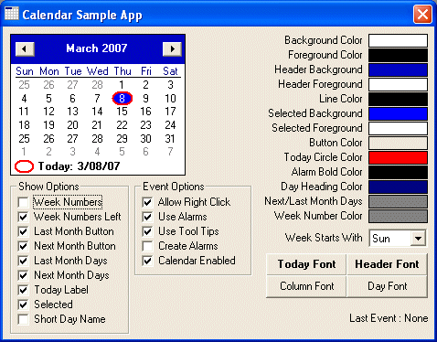



## Month View / Calendar Control

### Description

This is not a direct replacement of the MonthView control included in mscomct2.ocx but serves the same function...and then some. Includes control that could be compiled in to OCX (but probably makes more sense to be included directly in your project). It also has FAR more events and control of colors. This was originally written for a small scheduling tool where I needed to include alarm events (shown in bold on the days where the events occur). Calendar control also includes font selection, week numbers, short day headings (S,M,T instead of Sun, Mon, Tue), removal today circle, first day of week selection, right click enable, next month, last month buttons and date scroll control. *UPDATED March 9,2007* Should work with dd/mm/yyyy formats. For some unknown reason, some regions don't like the size of the fonts!?!? Absolutely no idea what that's about.
 
### More Info
 

             |
---                |---
**Submitted On**   |2007-03-09 14:28:28
**By**             |[Paul Mather](https://github.com/Planet-Source-Code/PSCIndex/blob/master/ByAuthor/paul-mather.md)
**Level**          |Intermediate
**User Rating**    |4.8 (24 globes from 5 users)
**Compatibility**  |VB 6\.0
**Category**       |[OLE/ COM/ DCOM/ Active\-X](https://github.com/Planet-Source-Code/PSCIndex/blob/master/ByCategory/ole-com-dcom-active-x__1-29.md)
**World**          |[Visual Basic](https://github.com/Planet-Source-Code/PSCIndex/blob/master/ByWorld/visual-basic.md)
**Archive File**   |[Month\_View205275392007\.zip](https://github.com/Planet-Source-Code/paul-mather-month-view-calendar-control__1-68088/archive/master.zip)

